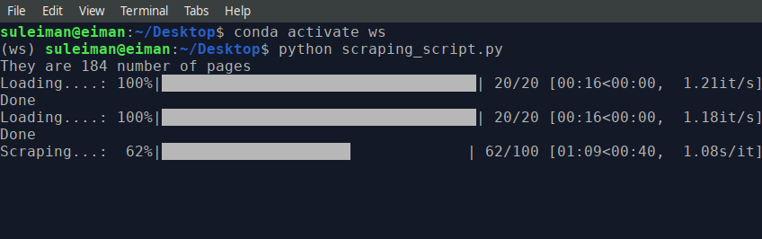
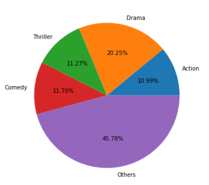
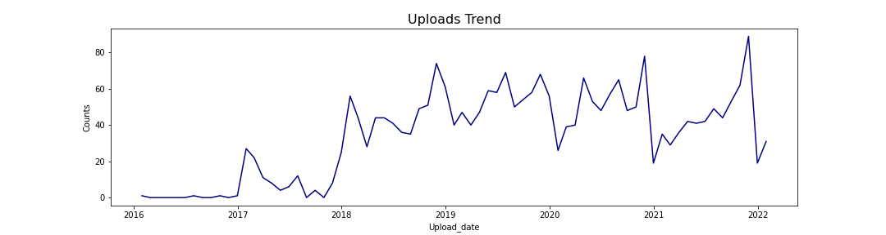

<h1 align = "center"> Netnaija Exploratory Data Analysis<h1>


[](https://colab.research.google.com/drive/1CfV6yEsHBjFiJbTKwY72k2g4AvszcF5R)


### Table of Contents
<ul>
<li><a href="#intro">Introduction</a></li>
<li><a href="#wrangling">Data Wrangling</a></li>
<li><a href="#eda">Exploratory Data Analysis</a></li>
<li><a href="#conclusions">summary</a></li>
</ul>

##  Introduction <a name = "introduction"></a>
Netnaija free is media download center created on March of 2016. The project aims webscraping data from the movies section. Movies that has been uploaded from 2016 till date will be scarped. Assuming the role of Data analyst the scraped data will be cleaned and analyze for insights.
The main moltivation behind this project was the the lack of dirty data to paractise my data cleaning skill and Netnaija been one of my favourite movie site I decidec to scrape and analyse it data.

## Data Scraping <a name = "data-scraping"></a>
For the purpose of the analysis, Each movietitle, movie link, movie type, time of upload,movie length, number of comment, movie summary, Genre, Release Date, Stars, movie Languages, movie Subtitles, IMDB links were scraped. Not all not all feature listed werepresent in some movie in which case I replaced them with missing. The Scraping was done using using Beatutiful soup and Request libarary. Click [here]() for dataset and [here]() for scraping script.


### Run Script


```bash
# clone the project
1 git clone https://github.com/Sachimugu/Net_Naija.git
```
```bash
# enter the project directory
2. cd Credit-card-approval-prediction-classification
```
```bash
# Create a conda virtual environment and install all the packages
3. conda env create --name <env_name> pandas requests bs4
```


```bash
# Activate the conda environment
4. conda activate <env_name>
```
```bash
# run scrpt
5. python Scraping_script.py
```


## Data Cleaning <a name = "data-cleaning"></a>
After getting the scraped data, pandas package was used to do some cleaning by droping duplicate rows, removing parantenses and semi colon present in the  scraped data. Columns that were not significant to the analysis were also droped. Regex was used to parse the movie from the title added it to the upload date. Each column was casted to the appropriate date type. Nan values were removed, replaced or left alone depending on the column and final index was set to be the upload date. After the process 82% of row and 11 columns were left for the analysis.

### Glance at Results
**Top three stars with most number of movies are:**
||||
|-------------------	        |------------------	|-----------|
| | | |
|Nicolas Cage|Bruce Willis|Samuel L. Jackson|


**Top 4 genre with others genre in a pie chart**



 Drama: 20.25%, Comedy: 11.70%, Thriller: 11.27%,Action: 10.99%, Other:  45.78%

 **Upload Trend**
 
 They seems to be a surge in number of upload in the first quater of each year.

 Explore the notebook file [here]()
 Download full report [here]()

### Repository structure
```
├── assets
│   ├── banner.png                                      <----- Readme banner
│   ├── nicolas.jpeg                                    <----- Readme Nicolas Cage photphoto
│   ├── pie.png                                         <----- Readme Pie chart
│   ├── samuel.png                                      <----- Readme Samuel l jackson phot
│   ├── script.png                                      <----- Readme Scraping photo
│   ├── Trend.png                                       <----- Readme Trend photo
│   └── willis.jpeg                                     <----- Readme Bruce Willis photo
├── Dataset
│   └── netnaija_movie.csv                              <----- Dataset
├── Notebook
│   ├── Data_Wrangling_and_EDA.html                     <----- Notebook code in html
│   └── Data_Wrangling_and_EDA.ipynb                    <----- Notebook code
├── Readme.md                                           <----- GitHub Readme file
├── Report
│   └── netnaija.pdf                                    <----- Analysis Report
└── Web_Scraping
    └── scraping_script.py                              <----- Webscraping Script

```

## Conculsion:

Through this project I was able to work on my webscraping and data cleaning to gain insight to the data

## Contact

<a href="mailto:sachimugu@gmail.com">  </a>
<a href="https://www.linkedin.com/in/achimugu-a-79aa8a18a/">  </a>
<a href="https://twitter.com/achimugu_a">  </a>
<a href="https://medium.com/@sachimugu">  </a>
