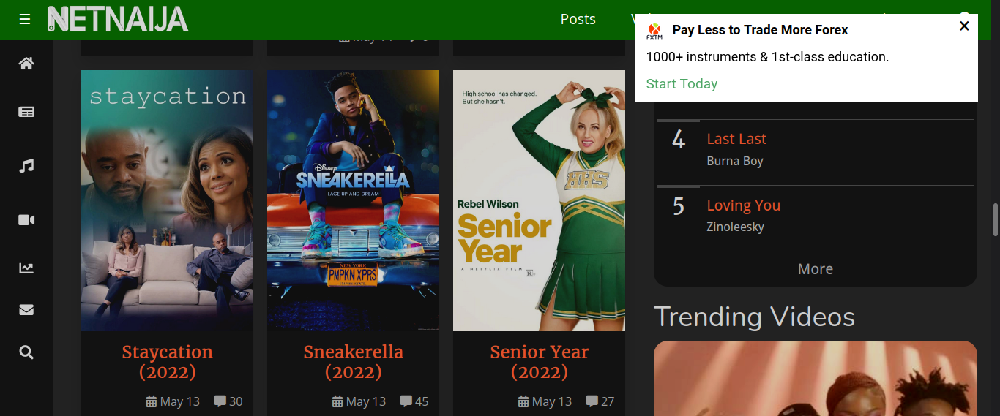
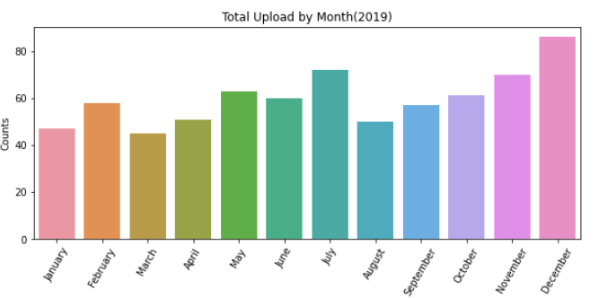
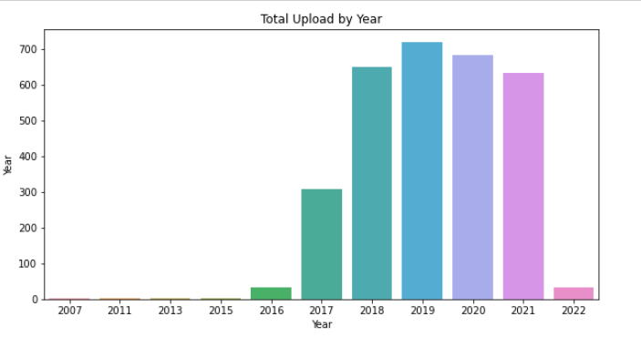
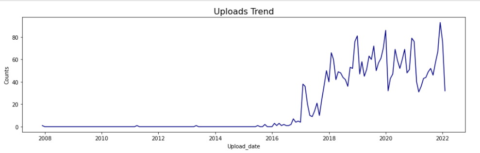

<h1 align = "center"> Netnaija Exploratory Data Analysis<h1>



## Table of Contents

  - [Business problem](#business-problem)
  - [Tech Stack](#tech-stack)
  - [Data source](#data-source)
  - [Data Cleaning](#data-Cleaning)
  - [Results](#Results)
  - [Lessons learned](#lessons-learned)
  - [Notebook & Repository structure](#notebook-repository-structure)
  - [Contribution & License](#contribution)
  - [Contact](#contact)


## Business problem:
The main moltivation for this project was the the lack of dirty data to paractise my data cleaning skill of kagel
## Data source
    
The data was scraped from the web <a href='www.netnaija.com'>Netnaija</a> my favoratie go to site for latest movies and series. using Beatutiful soup and Request libarary. Each movie title, movie link, movie type, time of upload, movie length, num of comment, movie summary, Genre, Release Date, Stars, movie Languages, movie Subtitles, imdb links was scraped. Not all not all feature listed were present in some movie for such case i replaced them with 'missing'

## Data Cleaning
After i got the raw data, I used pandas package to do some cleaning. I droped duplicate rows, removed parantenses and colon present in the data, droped columns that were not usefull. I also used regex to parse the movie from the title added it to the upload date and casted the column to date type. NAN values were removed, replaced or left alone depending on the column and final all columns were casted to the relvant data type.

## Data Analysis and Result

Before the project some of the question i had in mind and need to be answered were
**Questions**
- Which year has the highest number of upload?
- Find the number of movies by month in the year 2019
- What movies has highest movie length?
- Find movies which Jason Statham acted
- compared number of movies with gnere horror and animation using a Piechart
- show the distribution of comment using a Histograph
  
## Results
|||
|-------------------	        |------------------	|
| | |
|  |

## Explore the notebook

To explore the notebook file [here](https://nbviewer.org/github/semasuka/Credit-card-approval-prediction-classification/blob/main/Credit_card_approval_prediction.ipynb)

## Lessons learned
```
├── assets
│   ├── net1.png
│   ├── net.png
│   ├── pie.png
│   ├── README.md
│   ├── tota_2019.png
│   ├── total_by_year.png
│   └── trend.png
├── Dataset
│   └── netnaija_movie.csv
├── Notebook
│   └── Data_Wrangling_&_EDA.ipynb
├── Readme.md
├── Report
└── Web_Scraping
    └── scraping_script.py
```

## Conculsion:

Through this project I was able to work on my webscraping and data cleaning to gain insight to the data

## Contact
Email
linkdIn
Twitter
